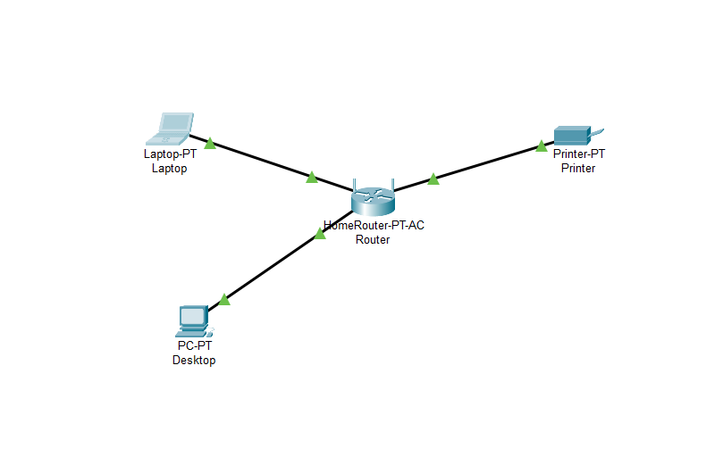
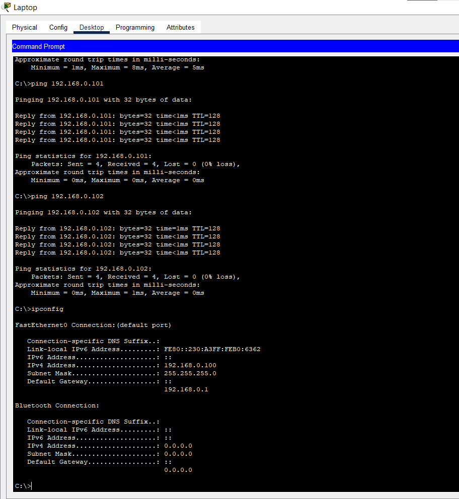

# 🧪 Network Simulation Lab (Cisco Packet Tracer)

## 📌 Overview
This project demonstrates the setup of a basic virtual network using **Cisco Packet Tracer**. The goal is to simulate a secure and functional environment for learning and testing network configurations, connectivity, and protocols without requiring physical devices.

## 🎯 Objective
- Install and explore a network simulation tool.
- Build a basic network topology with PCs, a switch, and a printer.
- Assign IP addresses.
- Test communication using the `ping` command.

## 🛠️ Tools Used
- **Cisco Packet Tracer** (Beginner-friendly network simulation tool)

## 📐 Network Topology
Devices:
• Desktop:      192.168.0.102 / 255.255.255.0

• Laptop:       192.168.0.100 / 255.255.255.0

• Printer:      192.168.0.101 / 255.255.255.0

• Router Gateway:  192.168.0.1/24

## 🔄 Connectivity Test
Used the `ping` command from Laptop to Desktop and Printer. All pings were successful, indicating proper configuration and connectivity.

## 📷 Screenshots

## 📂 Files Included
- `PacketTracer_Network.pkt`: The working network simulation file.
- `screenshots/`: Visuals of the network and testing process.
- `Report.pdf`: Summary of the project.

## 🔒 Cybersecurity Relevance
Network simulation is essential for practicing segmentation, firewall rules, protocol analysis, and vulnerability testing in a controlled environment—skills crucial to any cybersecurity role.

---

