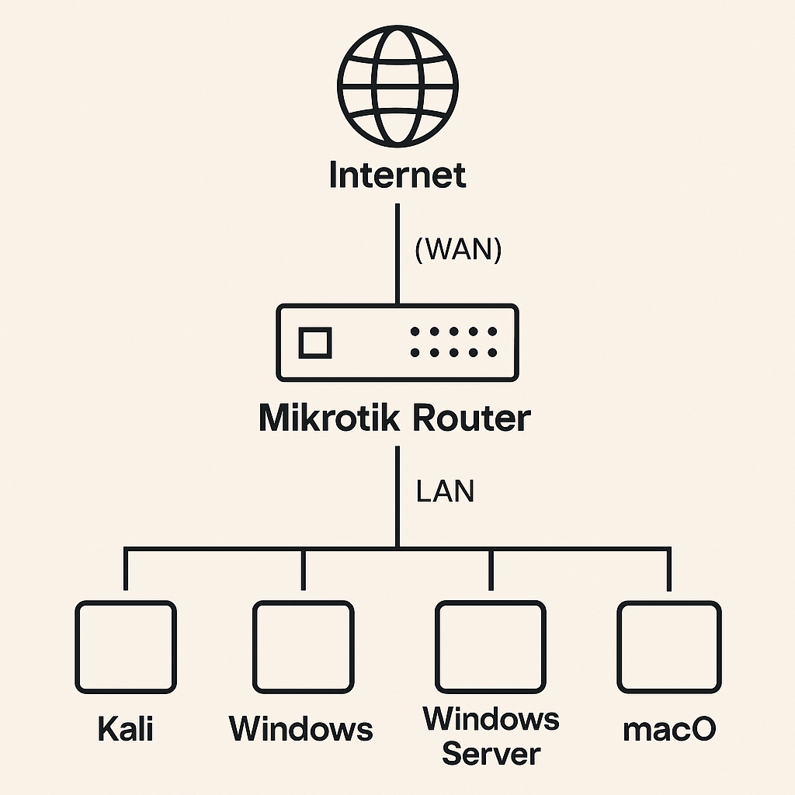

# 🛡️ VMware Cybersecurity Lab with MikroTik RouterOS

## 📌 Project Overview
This project demonstrates how to build a fully virtualized network within VMware Workstation, where all virtual machines are routed through a MikroTik router. This setup is ideal for cybersecurity testing, firewall rule simulation, and enterprise-level network segmentation training.

## 💡 Key Features
- ✔️ MikroTik as the core DHCP and gateway router
- ✔️ VMs on custom VMnet interfaces
- ✔️ DHCP, NAT, and firewall configuration on MikroTik
- ✔️ Includes: Windows Server (Active Directory), Kali Linux, macOS, and other VMs
- ✔️ Internet access preserved via NAT rules
- ✔️ Fully contained lab for cybersecurity practice

## 🧰 Tools Used
- VMware Workstation
- MikroTik RouterOS (CHR image)
- Kali Linux
- Custom VMnet adapters for internal segmentation

## 🖼️ Lab Topology

## ⚙️ Setup Guide
[Virtual Lab Guide](docs/VirtualLabGuide.pdf)
