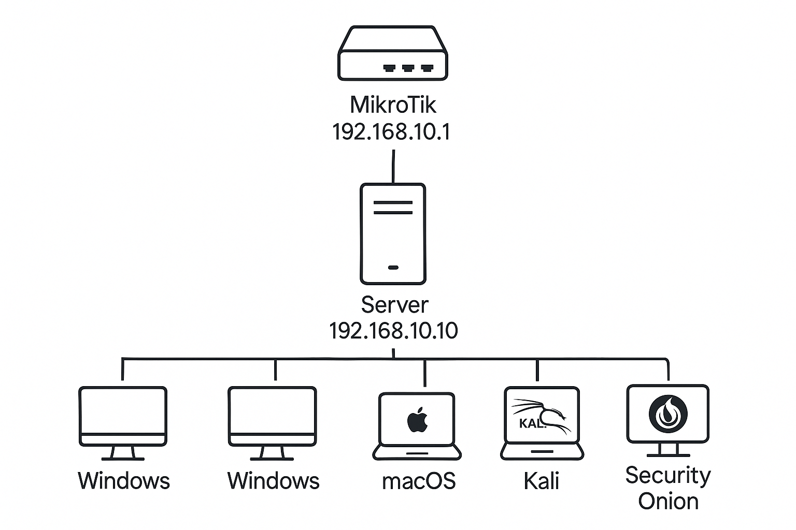

# 🛡️ Cybersecurity VMware Lab: Active Directory, DHCP, DNS & MikroTik Integration

Welcome to my hands-on cybersecurity lab built entirely in VMware. This lab simulates a real enterprise network with Active Directory services, DHCP/DNS, MikroTik routing, client systems, and scalable architecture for blue/red team training, SIEM integration, and enterprise-level security configuration.

---

## 🗺️ Network Topology

- **MikroTik Router (Gateway):** `192.168.10.1`
- **Windows Server 2022 (DC, DHCP, DNS):** `192.168.10.10`
- **DHCP Scope:** `192.168.10.100 – 192.168.10.200`
- **Clients:** Windows 10 (Domain-Joined), macOS, Security Onion

---

## 🔧 Lab Features

✅ Windows Server 2022 (GUI-based)  
✅ Active Directory Domain Services (AD DS)  
✅ DHCP and DNS Server Configuration  
✅ MikroTik Router with Static IP to Server  
✅ Domain-joined Windows client  
✅ Future-ready for RADIUS, Security Onion, and more

---

## 🪜 Step-by-Step Configuration

### 📌 1. Windows Server 2022 Setup
- Installed Server Desktop Experience via VMware
- Set static IP: `192.168.10.10`
- Renamed server to `DEELABSERVER`

---

### 📌 2. Active Directory, DNS & DHCP
- Installed AD DS, DNS, DHCP via Server Manager
- Promoted to Domain Controller for `deelabserver.com`
- Configured DNS zone and DHCP address pool `192.168.10.100 - 200`

---

### 📌 3. MikroTik Router Configuration
- MikroTik set to static IP `192.168.10.1`
- NAT and DHCP disabled (Windows Server handles DHCP)
- LAN port connected to virtual switch (VMnet2)

---

### 📌 4. Windows 10 Domain Join
- Set IP via DHCP (confirmed from scope)
- Joined domain: `deelabserver.com`
- Domain credentials validated via GUI

---

### 📌 5. User Management
- Created user `gblack` in ADUC (Active Directory Users and Computers)
- Added to `Domain Users` group
- Tested login on Windows client

---

## 🔮 Future Lab Extensions
- 🔐 RADIUS/NPS setup for 802.1X
- 🧱 Security Onion integration for IDS/SIEM
- 📊 Event forwarding to centralized logging server
- ⚡️ Automating AD tasks with PowerShell

---

## 📖 Documentation
Download the full step-by-step PDF guide here:  
📄 [`docs/lab-setup-guide.txt`](./docs/lab-setup-guide.txt)

---

## 🧑‍💻 About Me

I’m a cybersecurity analyst building real-world environments to sharpen my skills in infrastructure defense, enterprise administration, and red/blue teaming.

🔗 Connect with me on [LinkedIn](https://www.linkedin.com/in/ediomobrendan)  
📂 Explore other projects in my [GitHub Portfolio](https://github.com/Ecbrendan)

---

## 📢 Contributions & Feedback

This lab is open for feedback and collaboration. If you find this helpful or want to build on it, feel free to fork or submit issues/suggestions.

